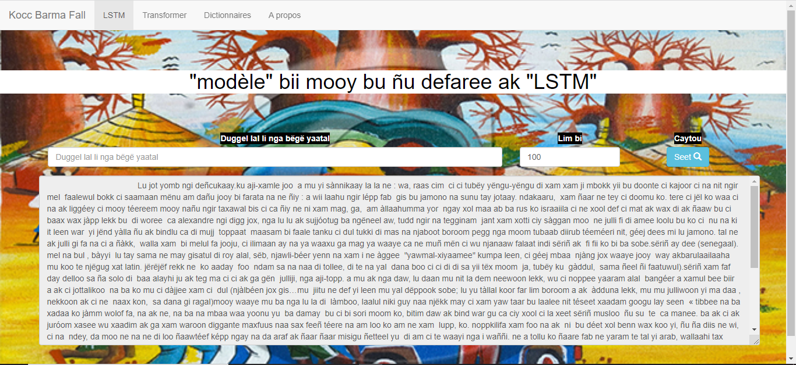

# Générateur de textes wolof

Ce référentiel github contient un code source python qui permet de générer automatiquement du texte wolof grâce à Pytorch et à un modèle avec les transformers et un modèle avec la couche LSTM.

Installer les bibliothèques de requirements.txt et executer le fichier app.py

Le rendu devrait être à peu près similaire à ceci :

